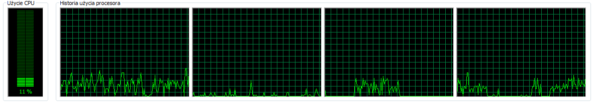
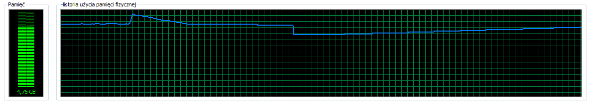

[&#8810;](../exercise1.md) powrót

## Rozwi¹zanie <b>Zadania 1a</b>

| Database		| Import time	|
| ------------- |:-------------:|
| MongoDB		| 54m56s		|
| PostgreSQL 	| 1h08m5s		|

 

<h4 id="mongodb">MongoDB<h5>

<b>Polecenie</b>

	Measure-Command -Expression {mongoimport --db experiment --collection train --type csv --file .\Train.csv --headerline}
	
##### Ciekawostki
	
Przed wykonaniem zadania pojawi³ siê problem z importem danych do Mongo. 
O co chodzi zorientowa³em siê dopiero po za³adowaniu danych do bazy. 
Okaza³o siê, ¿e w bazie jest o du¿o za du¿o rekordów - bo a¿ <b>100mln</b>! 
Po skonfrontowaniu siê z problemem i wstêpnym przegl¹dzie pliku <i>"wyrwa³em chwasta"</i> - zamieni³em znaki <b>CRLF</b> na <b>LF</b> i zaimportowa³em dane z nowego pliku do bazy. 
Wiêcej info. pod [linkiem](http://www.kaggle.com/c/facebook-recruiting-iii-keyword-extraction/forums/t/5594/number-of-train-test-cases-nested-csv-issues/29857#post29857)
	
##### Obserwacje

- <b>CPU</b> - podczas importu danych tylko <b>2</b> (<b>1</b> i <b>3</b> lub <b>1</b> i <b>4</b>) rdzenie spoœród dostêpnych <b>4</b> pracowa³y na wy¿szych obrotach. Drugi rdzeñ pracowa³ ze znacznie mniejszym obci¹¿eniem. Ca³kowite u¿ycie CPU nie przekroczy³o 30%.

- <b>RAM</b> - zu¿ycie pamiêci nie przekracza³o <b>5GB</b> (z maks. <b>6GB</b>). Dodatkowo da³o siê zaobserwowaæ skoki podczas zwalniania pamiêci, a czêstotliwoœci zwalniania by³a niesta³a.

- <b>Dysk</b> - sytuacja podobna do tej z RAM-em - co jakiœ czas dane tymczasowe by³y usuwane, aby odzyskaæ miejsce na dysku. 
Ca³kowite u¿ycie miejsca na dysku: <b>10324.867MB</b>.

> Kilka screen-ów:

 

<h4 id="postgresql">PostgreSQL<h5>

Przed wykonaniem importu nale¿a³o utworzyæ tabelê train

	CREATE TABLE train(
		id INT PRIMARY KEY,
		title VARCHAR(255),
		body TEXT,
		tags VARCHAR(4095)
	);

<b>Polecenie</b>

	Measure-Command -Expression {.\psql -U test -d experiment -c "COPY train(Id, Title, Body, Tags) FROM '.\Train.csv' WITH DELIMITER ',' CSV HEADER"}
	
##### Ciekawostki

Aby przyspieszyæ import danych do bazy Postgres-a zastosowa³em siê do punktów zamieszczonych w [dokumentacji](http://www.postgresql.org/docs/9.1/static/populate.html)
	
##### Obserwacje

Podczas importu do bazy PostgreSQL zu¿ycie pamiêci oraz procesora by³o znacznie mniejsze (nawet w szczytowym momencie).

 

#### KONKLUZJA:
<i>Dziêki "podrasowaniu" szybkoœci importowania danych dla bazy PostgreSQL, ró¿nica czasowa wykonanych zadañ miêdzy obiema bazami nie by³a zbyt wielka.</i>