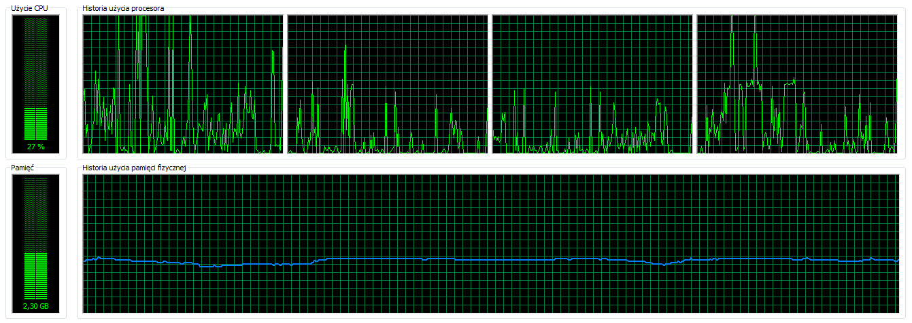
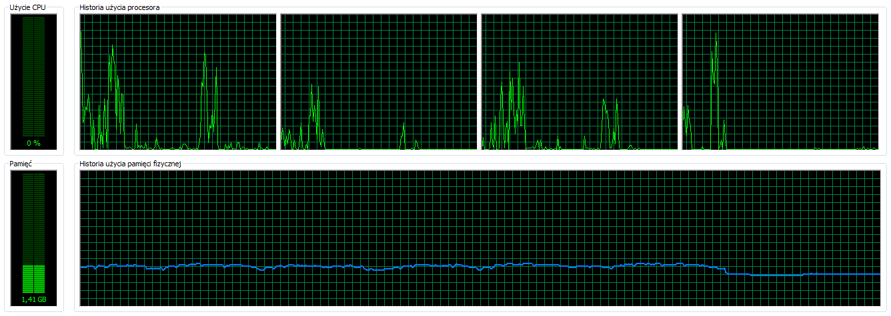

[&#8810;](../exercise1.md) powrót

## Rozwiązanie <b>Zadania 1a</b>

~~<b>[Problem z importem, z WiredTiger w wersji 2.8.0-rc0](./resources/wiredtiger_import_fail.md
)</b>?!~~ - więcej na ten temat:
* [Jira MongoDB #SERVER-16118](https://jira.mongodb.org/browse/SERVER-16118)
* [Jira MongoDB #SERVER-16124](https://jira.mongodb.org/browse/SERVER-16124)

| Database					| Storage system:Compression	| Import time	| Disk space 	|
| ------------------------- |:-----------------------------:|:-------------:|:-------------:|
| MongoDB 2.6.5				| MMAP:none						| 54m56s		| 10324.867MB	|
| MongoDB 2.8.0 rc0			| WiredTiger:none				| FAILED		| N/A			|
| MongoDB 2.8.0 rc1-pre-	| WiredTiger:none				| 24m09s		| 7129.242MB	|
| MongoDB 2.8.0 rc1-pre-	| WiredTiger:zlib				| 17m44s		| 3426.680MB	|
| PostgreSQL 				| N/A							| 1h08m05s		| 6649.088MB	|

 

<h4 id="mongodb">MongoDB<h5>

<b>Polecenie</b>

	Measure-Command -Expression {mongoimport --db experiment --collection train --type csv --file .\Train.csv --headerline}
	
#### Ciekawostki
	
Przed wykonaniem zadania pojawił się problem z importem danych do Mongo. 
O co chodzi zorientowałem się dopiero po załadowaniu danych do bazy. 
Okazało się, że w bazie jest o dużo za dużo rekordów - bo aż <b>100mln</b>! 
Po skonfrontowaniu się z problemem i wstępnym przeglądzie pliku <i>"wyrwałem chwasta"</i> - zamieniłem znaki <b>CRLF</b> na <b>LF</b> i zaimportowałem dane z nowego pliku do bazy. 
Więcej info. pod <b>[linkiem](http://www.kaggle.com/c/facebook-recruiting-iii-keyword-extraction/forums/t/5594/number-of-train-test-cases-nested-csv-issues/29857#post29857)</b>
	
#### Obserwacje

<b>MMAP</b>

- <b>CPU</b> - podczas importu danych tylko <b>2</b> (<b>1</b> i <b>3</b> lub <b>1</b> i <b>4</b>) rdzenie spośród dostępnych <b>4</b> pracowały na wyższych obrotach. Drugi rdzeń pracował ze znacznie mniejszym obciążeniem. Całkowite użycie CPU nie przekroczyło 30%.

- <b>RAM</b> - zużycie pamięci nie przekraczało <b>5GB</b> (z maks. <b>6GB</b>). Dodatkowo dało się zaobserwować skoki podczas zwalniania pamięci, a częstotliwości zwalniania była niestała.

- <b>Dysk</b> - sytuacja podobna do tej z RAM-em - co jakiś czas dane tymczasowe były usuwane, aby odzyskać miejsce na dysku. 
Całkowite użycie miejsca na dysku: <b>10324.867MB</b>.

<b>WiredTiger</b>

- <b>CPU</b> - zdecydowanie większę zużycie zasobów w porównaniu do MMAP. Wszystkie rdzenie pracowały przez cały czas na poziomie 30-50%.

- <b>RAM</b> - zużycie pamięci nie przekraczało <b>2.5GB</b>

#### Kilka screen-ów:

<b>MMAP</b>

 

<b>WiredTiger:none</b>

 

<b>WiredTiger:zlib</b>

 

<h4 id="postgresql">PostgreSQL<h5>

Przed wykonaniem importu należało utworzyć tabelę train

	CREATE TABLE train(
		id INT PRIMARY KEY,
		title VARCHAR(255),
		body TEXT,
		tags VARCHAR(4095)
	);

<b>Polecenie</b>

	Measure-Command -Expression {.\psql -U test -d experiment -c "COPY train(Id, Title, Body, Tags) FROM '.\Train.csv' WITH DELIMITER ',' CSV HEADER"}
	
#### Ciekawostki

Aby przyspieszyć import danych do bazy Postgres-a zastosowałem się do punktów zamieszczonych w [dokumentacji Postgres-a](http://www.postgresql.org/docs/9.3/static/populate.html).
	
#### Obserwacje

Podczas importu do bazy PostgreSQL zużycie pamięci oraz procesora było znacznie mniejsze (nawet w szczytowym momencie).

 

### KONKLUZJA:
<i>Dzięki "podrasowaniu" szybkości importowania danych dla bazy PostgreSQL, różnica czasowa wykonanych zadań między obiema bazami nie była zbyt wielka.</i>
