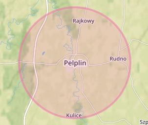
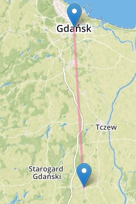

[&#8810;](../exercise1.md) powrót

## Rozwiązanie <b>Zadania 1d</b>

W celu zrealizowania powyższego zadania, sporządziłem bazę, która zawiera większość polskich miast oraz wsi.

<i>"Surowe"</i> dane pobrałem ze strony <b>[Cybermoon](http://cybermoon.pl/wiedza/wspolrzedne/wspolrzedne_polskich_miejscowosci_a.html)</b>,
a do obróbki użyłem własnych skryptów - do pobierania i parsowania treści strony.

Zebrane dane najpierw zapisałem w formacie <b>CSV</b>, co później pozwoliło mi na skorzystanie ze skryptu znajdującego się na <b>[tutaj](https://github.com/gavreh/csv-to-geojson)</b>.

Pojawił się jeszcze jeden problem - brak zakodowanych specjalnych znaków w formacie <i>unicode</i>, co też rozwiązałem przy pomocy dodatkowego skryptu.

Po otrzymaniu docelowego formatu - <b>GeoJSON</b>, zaimportowałem dane do bazy:

	mongoimport --db experiment --collection polish_cities --stopOnError --file polish_cities.geo.json
	
 

Do niektórych zapytań użyłem <i>"narysowanych"</i> przeze mnie obszarów typu <b>MultiPolygon</b>.
Zrealizowałem to za pomocą narzędzia <b>[GeoJSON editor](http://blog.sallarp.com/geojson-google-maps-editor.html)</b>.

#### Geospatial Query 1

Na początek dowiedzmy się, ile miast znajduje się w promieniu 5km od mojego rodzinnego miasta - <b>Pelplina</b>.

<pre>
var pelplinCoords = db.polish_cities.findOne({"properties.nazwa": "Pelplin"}).geometry.coordinates;
db.polish_cities.find({
	geometry: {
		$near: {
			$geometry: { type: "Point",  coordinates: pelplinCoords },
			$minDistance: 1,
			$maxDistance: 7000
		}
	}
}).count();
<b>9</b>
</pre>

<b>[GeoJSON z miastami](./resources/pelplin_5km_area.geo.json)</b>.

#### Geospatial Query 2

Teraz znajdźmy miasta znajdujące się na linii prostej poprowadzonej z <b>Pelplina</b> do <b>Gdańska</b>.

<pre>
var pelplinCoords = db.polish_cities.findOne({"properties.nazwa": "Pelplin"}).geometry.coordinates;
var gdanskCoords = db.polish_cities.findOne({"properties.nazwa": "Gdańsk"}).geometry.coordinates;
var line = {
	"type": "LineString",
	"coordinates": [pelplinCoords, gdanskCoords]
};
db.polish_cities.find({
	geometry: {
		$geoIntersects: {$geometry: line}
	}
}).count();
<b>3</b>
</pre>

#### Geospatial Query 3

W następnym zapytaniu policzymy wszystkie miasta/wsi znajdujące się w <b>woj. pomorskim</b>.

Do zrealizowania tego zapytania użyję sporządzonego przeze mnie <b>[GeoJSON-a województwa](./resources/pomorskie_area.geo.json)</b>.

<pre>
var pomorskieAreaCoords = db.polish_areas.findOne({ properties: { nazwa: "Pomorskie", typ: "wojewodztwo" }}).geometry.coordinates;
var pomorskieArea = {
	type : "MultiPolygon",
	coordinates: pomorskieAreaCoords
};
db.polish_cities.find({
	geometry: {
		$geoWithin: {
			$geometry: pomorskieArea
		}
	}
}).count();
<b>1954</b>
</pre>

<b>[GeoJSON z punktami](./resources/pomorskie_cities.geo.json)</b>

Jak można szybko wygoogle-ować, nasza baza jest niekompletna. Brakuje niemalże 800 wsi/miejscowości.

#### Geospatial Query 4

<b>Szczęśliwa trójka</b> - obszar największych miast w województwach <i>"pomorskich"</i>.

W tym zapytaniu obliczymy ilość miast, które znajdują się na polu trójkąta, 
gdzie punktami są 3 wybrane miasta: <b>Gdańsk</b> (pomorskie), <b>Szczecin</b> (zachodnio-pomorskie) oraz <b>Bydgoszcz</b> (kujawsko-pomorskie) - <b>[GeoJSON obszaru](./resources/lucky_triangle.geo.json)</b>.

<pre>
var gdanskCoords = db.polish_cities.findOne({ properties: { nazwa: "Gdańsk", wojewodztwo: "Pomorskie" }}).geometry.coordinates;
var szczecinCoords = db.polish_cities.findOne({ properties: { nazwa: "Szczecin", wojewodztwo: "Zachodniopomorskie" }}).geometry.coordinates;
var bydgoszczCoords = db.polish_cities.findOne({ properties: { nazwa: "Bydgoszcz", wojewodztwo: "Kujawsko-Pomorskie" }}).geometry.coordinates;
var area = {
	type: "Polygon",
	coordinates: [ [ gdanskCoords, szczecinCoords, bydgoszczCoords, gdanskCoords ] ]
};
db.polish_cities.find({
	geometry: {
		$geoWithin: {
			$geometry: area
		}
	}
}).count();
<b>1260</b>
</pre>

#### Geospatial Query 5

Tym razem porównamy 2 wyniki zapytań.

Gdzie może znajdować się większe skupisko miast, w promieniu 10km?
Koło Warszawy czy koło Krakowa?

<pre>
var wawaCoords = db.polish_cities.findOne({"properties.nazwa": "Warszawa"}).geometry.coordinates;
var krakowCoords = db.polish_cities.findOne({"properties.nazwa": "Kraków"}).geometry.coordinates;
var wawaCities = db.polish_cities.find({
	geometry: {
		$near: {
			$geometry: { type: "Point",  coordinates: wawaCoords },
			$minDistance: 1,
			$maxDistance: 10000
		}
	}
}).count();
var krakowCities = db.polish_cities.find({
	geometry: {
		$near: {
			$geometry: { type: "Point",  coordinates: krakowCoords },
			$minDistance: 1,
			$maxDistance: 10000
		}
	}
}).count();

wawaCities -> 55
krakowCities -> <b>56</b>
</pre>

#### Geospatial Query 6

I na koniec, policzymy ilość miast w regionie etnicznym mojego rodzinnego miasta, czyli Kociewia.

Do tego zadania sporządziłem <b>[GeoJSON-a z regionem Kociewia](./resources/kociewie_area.geo.json)</b>.

<pre>
var kociewieAreaCoords = db.polish_areas.findOne({ properties: { nazwa: "Kociewie", typ: "region" }}).geometry.coordinates;
var kociewieArea = {
	type : "MultiPolygon",
	coordinates: kociewieAreaCoords
}
db.polish_cities.find({
	geometry: {
		$geoWithin: {
			$geometry: kociewieArea
		}
	}
}).count();
<b>526</b>
</pre>