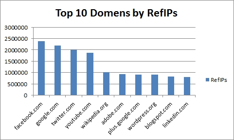
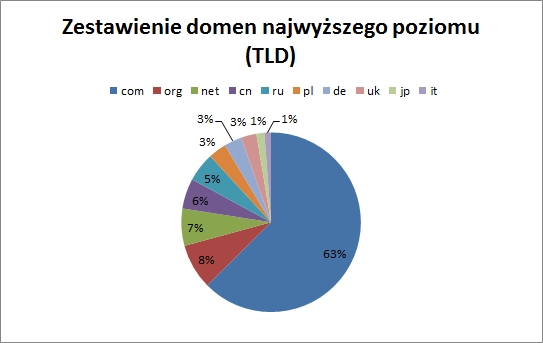

[&#8810;](../exercise2.md) powrót

## Rozwiązanie <b>Zadania 2</b>

Agregacje opierają się na danych pobranych z <b>[blogu Majestic](https://blog.majestic.com/development/majestic-million-csv-daily/)</b> + kilku dodanych przeze mnie rekordow.

Po pobraniu danych, dokonałem importu:

	mongoimport --db experiment --collection sites --type csv --file .\majestic_million.csv --headerline
	
Następnie przygotowałem agregacje opisane niżej.

#### Aggregation 1

Pierwsza agregacja adresy z największą ilością <b>RefIPs</b>.

Ostateczny wynik został ograniczny do 10 dokumentów.

	db.sites.aggregate(
		{ $project: { _id: 0, "GlobalRank": 1, "Domain": 1, RefIPs: "$RefIPs" } },
		{ $sort: { RefIPs: -1 } },
		{ $limit: 10 }
	);
	


<b>[Lista z wynikami](./resources/aggreg_1.json)</b>.

#### Aggregation 2

W tej agregacji zajmiemy się zestawieniem i zliczeniem 10 najbardziej popularnych domen najwyższego poziomu (<b>TLD</b>).

	db.sites.aggregate(
		{ $group: { _id: { TLD: "$TLD" }, count: { $sum: 1 } } },
		{ $sort: { count: -1 } },
		{ $limit: 10 }
	);
	

	
<b>[Lista z wynikami](./resources/aggreg_2.json)</b>.

#### Aggregation 3

Kolejna agregacja to: <i>największe skoki i spadki w globalnym rankingu</i> (<b>GlobalRank</b>)

	var ranking = {
		ups: db.sites.aggregate([
			{ $group: { _id: { domain: "$Domain", global_rank: { current: "$GlobalRank", previous: "$PrevGlobalRank" }, difference: { $subtract: [ "$PrevGlobalRank", "$GlobalRank" ] } } } },
			{ $match: { "_id.difference": { $gt: 0 } } },
			{ $limit: 10 },
			{ $sort: { "_id.difference": -1 } },
		],	{ allowDiskUse : true }),
		drops: db.sites.aggregate([
			{ $group: { _id: { domain: "$Domain", global_rank: { current: "$GlobalRank", previous: "$PrevGlobalRank" }, difference: { $subtract: [ "$GlobalRank", "$PrevGlobalRank" ] } } } },
			{ $match: { "_id.difference": { $gt: 0 } } },
			{ $limit: 10 },
			{ $sort: { "_id.difference": -1 } },
		],	{ allowDiskUse : true })
	};
	
| Domena        | Różnica       |
| ------------- |:-------------:|
| 0-0.mk		| +7771			|
| 0-360.com		| +5805			|
| 0-1bb.com		| +4155			|
| 0-60mag.com	| +2520			|
| 0-168.com		| +2455			|
| 0-15.cn		| +2448			|
| 0-00.biz		| +2235			|
| 0-100.com.cn	| +991			|
| 0-6.com.cn	| +598			|
| 0-6.com		| +192			|
| 0-host.net	| -14854		|
| 0-1.ru		| -12718		|
| 0-k.co.uk		| -11206		|
| 0.com			| -8425			|
| 0-50.ru		| -8309			|
| 0-6.in		| -2507			|
| 0.mk			| -1841			|
| 0-vod.biz		| -955			|
| 0-12.com		| -634			|
| 00-r.com		| -429			|
	
<b>[Wzloty...](./resources/aggreg_3_ups.json)
[...i upadki](./resources/aggreg_3_downs.json)</b>.

#### Aggregation 4

Na koniec zajmiemy się domenami, których nazwy składają się z samych cyfr (oprócz TLD).

	db.sites.aggregate(
		{ $match: { Domain: /^(\d+\.)+[a-z]+$/ } },
		{ $group: { _id: null, count: { $sum: 1 } } }
	);
	
```javascript
{
  "result": [
	{
	  "_id": null,
	  "count": 5787
	}
  ],
  "ok": 1
}
```
	
Kilka przykładowych domen:

	db.sites.aggregate(
		{ $match: { Domain: /^(\d+\.)+[a-z]+$/ } },
		{ $project: { _id: 0, GlobalRank: 1, Domain: 1 } },
		{ $limit: 10 }
	);
	
<b>[Lista z domenami](./resources/aggreg_4.json)</b>.