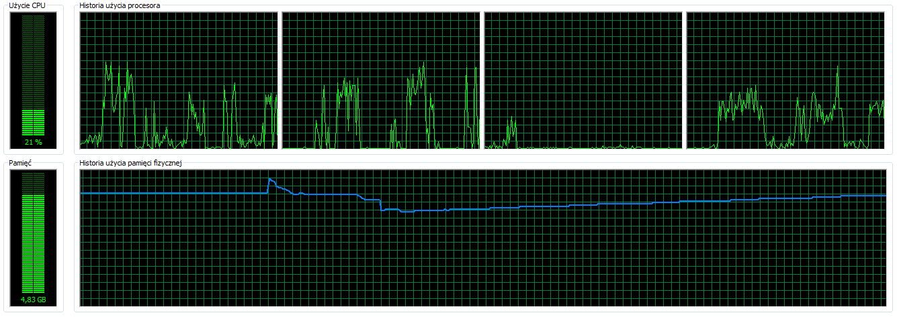

[&#8810;](../exercise3.md) powrót

## Rozwiązanie <b>Zadania 3b</b>

#### Problemy z importem

"Co do?! Jak przeparsować tego XML-a?" - zadałem sobie to pytanie po rozpakowaniu archiwum.
<i>Dump</i> polskiej Wikipedii okazał się nienajprostszym orzechem do zgryzienia, więc trzeba było wytoczyć cięższe działa.

Po chwili <i>"google-owania"</i> okazało się, że nie tylko ja miałem taki problem... na szczęście.<br />
<b>kodekrash</b> napisał <b>[skrypt](https://github.com/kodekrash/wikipedia.org-xmldump-mongodb)</b>, który jest wręcz stworzony do tego zadania, aby bezproblemowo zaimportować dane do bazy.<br />
Po uruchomieniu zdałem sobie sprawę, że skrypt jest strasznie nieoptymalny, co skłoniło mnie do wprowadzenia kilku poprawek:
- stream <b>XML-a</b> zamiast <b>BZIP-a</b>
- pobieranie całej linii, zamiast pojedyńczych znaków
- kilka mniejszych zmian

<b>[Link do przerobionego skryptu](./resources/wikipedia.org-xmldump-mongodb.php).</b>

Zmiana bardzo się opłaciła, skrypt przyspieszył o ok. 18x (z 13.5h na <b>45min!</b>).

#### Ilość artykułów

1671883

#### Zrzut z przebiegiem importu:



### Operacja "wyłuskania" wyrazów (MapReduce)

W celu <i>"wyłuskania"</i> interesujących nas wyrazów należało napisać wyrażenie regularne.
Dodatkowo postarałem się o usunięcie z <i>"surowego"</i> tekstu artykułów kilku zbędnych informacji, np. tagów (X)HTML, URL-i, podstawowej konstrukcji tabeli w kodzie Wikipedii.

Pierwszy <b>[skrypt](./resources/mapreduce.js)</b> z MapReduce wyglądał następująco:
```javascript
var connection = new Mongo();
var db = connection.getDB('experiment');

var mapFn = function () {
	// eliminacja niepotrzebnych ciągów znaków
	this.text = this.text.replace(/(<([^>]+)>)|\n|\\n|-align="?(right|center|left)"?|class="?wikitable"?|style=".+"|url = http:\/\/.+ |{{Cytuj (książkę|stronę) \||\[\[Plik\:[^\|]+\|/g, "");
	this.text = this.text.replace(/&nbsp;/g, " ");
	
	// wyłuskanie tego co potrzebne
	this.text = this.text.replace(/\[https?:\/\/[^ ]* (.*?)\]/g, "$1");
	
	var matches = this.text.match(/([a-zA-ZÀ-ÿąćęłńóśźżĄĆĘŁŃÓŚŹŻäöüßÄÖÜẞ]+)/g);
	
	// emit(new ObjectId(), text); // debug
	if (matches) {
		for (var i = 0; i < matches.length; i++) {
			emit(matches[i].toLowerCase(), 1);
		}
	}
	
	// zwolnienie zmiennych (pamięci)
	matches = undefined;
};

var reduceFn = function (word, counts) {
	return Array.sum(counts);
};

db.wiki_articles.mapReduce(
	mapFn,
	reduceFn,
	{ out: "wiki_words" }
);
```

Następnie zająłem się jego <b>[optymalizacją](./resources/mapreduce_multithreads.js)</b> (zgodnie z zamieszczonym artykułem pod tym <b>[linkiem](http://edgystuff.tumblr.com/post/54709368492/how-to-speed-up-mongodb-map-reduce-by-20x)</b>)

W tym celu wykorzystałem 2 ciekowostki zamieszczone we wcześniej wspomnianym artykule:
- wykorzystanie wielu wątków
- jsMode: <b>true</b>

```javascript
// inicjalizacja "wstrzykiwania" wątków
var connection = new Mongo();
var db = connection.getDB('experiment');

// inicjalizacja "wstrzykiwania" wątków
var numThreads = 4; // z ilu wątków będziemy korzystali

Thread = function() {
	this.init.apply( this, arguments );
}
_threadInject( Thread.prototype );

ScopedThread = function() {
	this.init.apply( this, arguments );
}
ScopedThread.prototype = new Thread( function() {} );
_scopedThreadInject( ScopedThread.prototype );

// operacja MapReduce
var mapReduce = function (min, max) {
	db.runCommand(
		{
			mapReduce: "wiki_articles",
			map: function () {
				// eliminacja niepotrzebnych ciągów znaków
				this.text = this.text.replace(/(<([^>]+)>)|\n|\\n|-align="?(right|center|left)"?|class="?wikitable"?|style=".+"|url = http:\/\/.+ |{{Cytuj (książkę|stronę) \||\[\[Plik\:[^\|]+\|/g, "");
				this.text = this.text.replace(/&nbsp;/g, " ");
				
				// wyłuskanie tego co potrzebne
				this.text = this.text.replace(/\[https?:\/\/[^ ]* (.*?)\]/g, "$1");
				
				var matches = this.text.match(/([a-zA-ZÀ-ÿąćęłńóśźżĄĆĘŁŃÓŚŹŻäöüßÄÖÜẞ]+)/g);
				
				// emit(new ObjectId(), text); // debug
				if (matches) {
					for (var i = 0; i < matches.length; i++) {
						emit(matches[i].toLowerCase(), 1);
					}
				}
				
				// zwolnienie zmiennych (pamięci)
				matches = undefined;
			},
			reduce: function (word, counts) {
				return Array.sum(counts);
			},
			out: { reduce: "wiki_words" },
			query: { _id: { "$gte": min, "$lte": max } },
			jsMode: true 
		}
	)
};

var maxKey = db.wiki_articles.findOne({ $query:{}, $orderby:{ _id:-1 } })._id;
var inc = Math.floor(maxKey / numThreads);
var threads = [];

// wywołanie wątków z odpowiednimi parametrami granicznymi
for (var i = 0; i < numThreads; ++i) {
	var min = (i == 0) ? 0 : i * inc + 1;
	var max = i * inc + inc;
    print("min:" + min + " max:" + max);
	
    var t = new ScopedThread(mapReduce, min, max);
    threads.push(t);
    t.start()
}

for (var i in threads) {
    var t = threads[i];
    t.join();
    printjson(t.returnData());
}
```